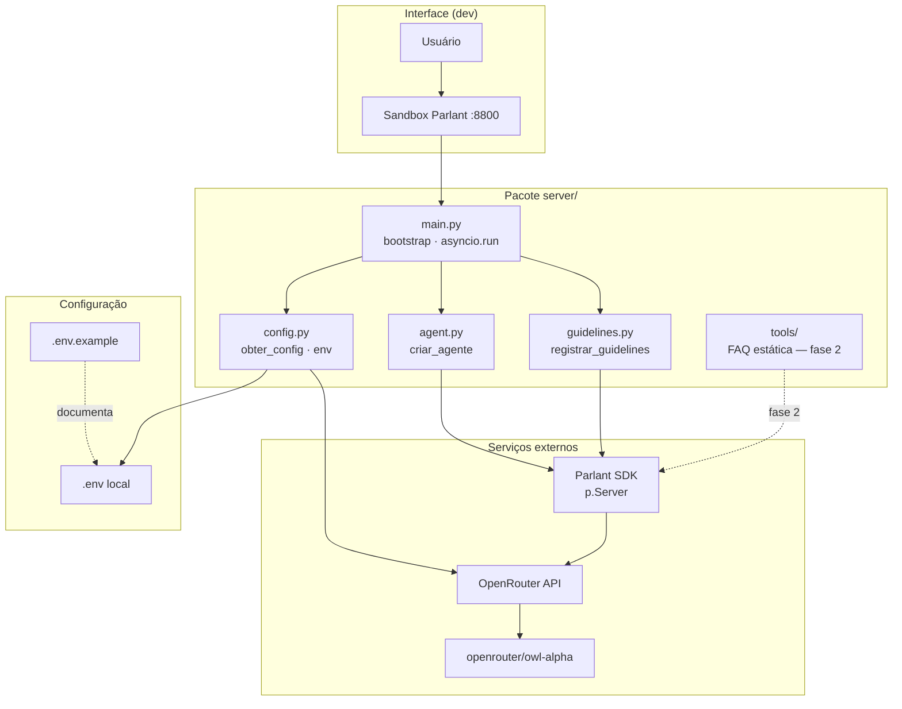

# Decisões de arquitetura — MVP Chatbot

Template de **ADR** (Architecture Decision Records). Preencha **em sala** (com IA) antes de pedir a criação do pacote `server/`.

> Referência: `arquitetura_mvp.md` (estrutura alvo). Após fechar as ADRs, use os prompts em `prompts.md` §2–§3 para gerar código.

---

## ADR-001 — Framework conversacional

| Campo | Conteúdo |
|-------|----------|
| **Status** | Aceita |
| **Contexto** | Precisamos de comportamento previsível, não só um prompt único. O assistente de onboarding deve seguir regras explícitas (escopo do curso, honestidade, tom) e evoluir para tools sem virar “prompt spaghetti”. |
| **Decisão** | Adotar **Parlant** (`parlant.sdk`) como framework de engenharia de contexto. Guidelines condicionais cobrem o MVP (≥ 3 regras em `escopo_mvp.md`); journeys, glossary e tools entram nas fases seguintes. A escolha alinha com o objetivo pedagógico da formação (controle e explicabilidade do agente) e com a integração nativa a OpenRouter via `NLPServices.openrouter`. |
| **Alternativas** | **LangChain / LangGraph** — ecossistema amplo, mas abstrações genéricas e maior risco de acoplamento a padrões que não são o foco do curso. **Prompt monolítico** (system prompt único no provider) — implementação rápida, porém difícil de revisar, testar e evoluir guideline a guideline. **OpenAI Assistants API direta** — menos controle local sobre guidelines e sandbox de desenvolvimento. |
| **Consequências** | **Positivas:** regras declarativas, sandbox local, explainability, caminho claro para tools. **Negativas:** curva de aprendizado do SDK Parlant; dependência de documentação e versão do pacote `parlant`; menos exemplos públicos que LangChain. **Neutras:** equipe deve consultar https://parlant.io/docs antes de aceitar código gerado por IA. |

---

## ADR-002 — Provider e modelo LLM

| Campo | Conteúdo |
|-------|----------|
| **Status** | Aceita |
| **Contexto** | Endpoint unificado; modelo agentic para o MVP. O agente precisa de contexto longo, suporte a instruções detalhadas e capacidade de tool use para a fase 2 (FAQ estática). |
| **Decisão** | Usar **OpenRouter** (`https://openrouter.ai/api/v1`) como provider, com modelo **`openrouter/owl-alpha`**, integrado via `p.NLPServices.openrouter(model_name="openrouter/owl-alpha", max_tokens=128_000)`. Autenticação por `OPENROUTER_API_KEY` carregada de `.env`. |
| **Alternativas** | **OpenAI GPT-4o direto** — qualidade alta, mas vendor lock-in e custo sem camada de troca de modelo. **Anthropic Claude via API própria** — bom para instruções longas, porém fora do contrato unificado do curso. **Modelo local (Ollama)** — sem custo de API, mas exige GPU/recursos e não espelha o ambiente de produção previsto. **Outro modelo OpenRouter** (ex.: Mistral, Llama) — possível via env, mas owl-alpha foi escolhido por ser open source e orientado a workloads agentic. |
| **Consequências** | **Positivas:** um único endpoint; troca de modelo futura alterando env; owl-alpha adequado a guidelines longas e tools. **Negativas:** dependência de quota e disponibilidade do OpenRouter; latência de rede; política de log do provider deve ser validada antes de uso em sala cheia. **Neutras:** custo por token — monitorar em desenvolvimento; nunca logar a API key (`padrao_projeto_mvp.md`). |

---

## ADR-003 — Layout de módulos (`server/`)

| Campo | Conteúdo |
|-------|----------|
| **Status** | Aceita |
| **Contexto** | Separar bootstrap, agente, guidelines e tools. O pacote deve ser gerável por IA, verificável por `verificar_arquitetura.py` e alinhado a `padrao_projeto_mvp.md` (responsabilidades distintas, nomenclatura em português). |
| **Decisão** | Pacote **`server/`** na raiz de `aula-06/` com a árvore abaixo. `main.py` — bootstrap e entrypoint; `config.py` — env e constantes; `agent.py` — `criar_agente()`; `guidelines.py` — registro das guidelines; `tools/` — tools Parlant (fase 2, diretório presente desde já com `__init__.py`). |
| **Alternativas** | **Monólito em `main.py`** — menos arquivos, porém mistura config, agente e guidelines; pior para prompts de IA e revisão de PR. **Layout por camada (`domain/`, `infra/`)** — over-engineering para o MVP de uma aula. **Pacote fora de `aula-06/` (monorepo compartilhado)** — antecipa complexidade de deploy e CI antes da entrega containerizada. |
| **Consequências** | **Positivas:** diff legível; portão `verificar_arquitetura.py` pode checar arquivos esperados; prompts §2 da aula têm alvo explícito. **Negativas:** mais arquivos para manter sincronizados com ADRs. **Neutras:** `tests/` e `ci/` ficam para entregas posteriores, conforme `arquitetura_mvp.md`. |

```
server/
├── __init__.py
├── config.py
├── main.py
├── agent.py
├── guidelines.py
└── tools/
    └── __init__.py
```

---

## ADR-004 — Configuração e segredos

| Campo | Conteúdo |
|-------|----------|
| **Status** | Aceita |
| **Contexto** | API key não pode ir para o repositório. O projeto precisa de defaults documentados, exemplo versionado e falha explícita quando variáveis obrigatórias estão ausentes. |
| **Decisão** | **`.env`** local (gitignored) + **`.env.example`** versionado com placeholders. Carregamento via **`python-dotenv`** no entrypoint (`main.py` ou `config.py`). Módulo **`server/config.py`** expõe `obter_config()` (ou equivalente) com constantes em `UPPER_SNAKE_CASE` (`MODELO_PADRAO`, `NOME_AGENTE`) e leitura de `OPENROUTER_API_KEY` e modelo (`OPENROUTER_MODEL` / alias documentado). Segredos nunca em log. |
| **Alternativas** | **Variáveis só no shell do SO** — funciona em CI, mas pior DX local para alunos. **Arquivo `config.yaml` versionado** — risco de vazar segredos se mal usado. **Pydantic Settings** — validação forte, mas dependência extra aceitável só se o time já adotar; para o MVP, `python-dotenv` + função explícita basta. **Secrets manager (Vault, cloud)** — fora do escopo desta entrega. |
| **Consequências** | **Positivas:** onboarding simples (copiar `.env.example` → `.env`); contrato claro para `verificar_arquitetura.py` e smoke tests. **Negativas:** disciplina manual para não commitar `.env`; divergência de nomes de env entre docs deve ser resolvida (ver dúvidas no registro §1). **Neutras:** em container/CI, mesmas chaves injetadas por env do orchestrator. |

---

## ADR-005 — Interface de desenvolvimento

| Campo | Conteúdo |
|-------|----------|
| **Status** | Aceita |
| **Contexto** | MVP sem front custom na primeira fase (`escopo_mvp.md` — fora do escopo: front-end custom em produção). É necessária interface para validar guidelines e respostas de onboarding. |
| **Decisão** | Usar o **Sandbox Parlant** em `http://localhost:8800` como interface principal de desenvolvimento e demo. O servidor Python sobe o runtime Parlant; a UI do sandbox substitui qualquer front React nesta fase. API Parlant fica como integração futura. |
| **Alternativas** | **Widget React em produção** — melhor UX final, adiado pós-MVP (`arquitetura_mvp.md` §6). **CLI interativa (`input()` / Rich)** — rápida de implementar, mas não exercita guidelines no mesmo ambiente que a entrega final. **Streamlit / Gradio** — UI custom com custo de manutenção e fora do stack acordado. **Postman/curl na API** — útil para debug, insuficiente para validar comportamento conversacional com guidelines. |
| **Consequências** | **Positivas:** zero código de front no MVP; alinhado ao fluxo de teste (“5 perguntas de teste” no DoD); explainability do Parlant visível na UI. **Negativas:** dependência da porta 8800 e do processo do sandbox; menos controle visual que um front próprio. **Neutras:** Definition of Done do projeto final ainda exige container — sandbox continua válido dentro do container. |

---

## ADR-006 — Tools e RAG

| Campo | Conteúdo |
|-------|----------|
| **Status** | Aceita |
| **Contexto** | Escopo limitado no MVP. RAG em escala sobre o monorepo e persistência multi-tenant estão explicitamente fora do escopo (`escopo_mvp.md`). |
| **Decisão** | Abordagem **faseada**: **Fase 1 (esta entrega de arquitetura / próxima de implementação)** — agente + **guidelines mínimas** (escopo, honestidade, tom, segurança); diretório `server/tools/` criado vazio. **Fase 2** — tool Python de **FAQ estática** (respostas fixas sobre módulos e fluxo do curso), testável com pytest. **Fora do MVP** — vector DB, RAG sobre todo o repositório, múltiplos idiomas. |
| **Alternativas** | **RAG desde o dia 1** — respostas mais ancoradas em docs, porém complexidade de ingestão, chunking e avaliação fora do tempo da aula. **Sem tools (só LLM + guidelines)** — mais simples, mas pior para fatos repetíveis (nomes de módulos, URLs) e para trilha de testes. **Tool que lê o filesystem do monorepo em runtime** — flexível, mas lento, difícil de testar e arriscado em container sem mount controlado. |
| **Consequências** | **Positivas:** entrega incremental; pytest focado em tools na fase 2; guidelines cobrem alucinação até a FAQ existir. **Negativas:** janela em que o modelo depende só de guidelines para fatos do repo. **Neutras:** `mapa_disciplinas.md` e docs podem alimentar a FAQ estática sem embedding. |

---

## ADR-007 — Entrypoint assíncrono

| Campo | Conteúdo |
|-------|----------|
| **Status** | Aceita |
| **Contexto** | SDK Parlant usa `async with p.Server()`. O runtime é inerentemente assíncrono; bloquear ou contornar isso quebra o contrato do SDK. |
| **Decisão** | **`asyncio.run(main())`** em `server/main.py`, com `async def main()` que orquestra: carregar config → (nesta aula) validar env e/ou subir `p.Server` conforme maturidade da entrega. Criação do agente delegada a `agent.py`; guidelines registradas via `guidelines.py`. Na entrega atual de arquitetura, `main` pode **apenas validar config**; subir `p.Server` completo fica para a entrega seguinte (`arquitetura_mvp.md` §2). |
| **Alternativas** | **`uvicorn` / ASGI app separado** — útil se expusermos HTTP custom; desnecessário enquanto o sandbox Parlant for a UI. **Loop manual `asyncio.get_event_loop()`** — padrão legado; `asyncio.run` é o idioma Python 3.11+. **Script síncrono que chama APIs REST do Parlant** — evita o SDK, perde integração direta com guidelines/tools. |
| **Consequências** | **Positivas:** alinhado ao SDK; composição testável (`criar_agente` importável). **Negativas:** testes de integração podem precisar de `pytest-asyncio` na fase seguinte. **Neutras:** smoke desta aula pode passar sem rede se `main` só validar config; `python -m server.main` com `.env` completo valida o caminho feliz na implementação. |

---

## Decisões adiadas

| ID | Tema | Por que adiar |
|----|------|----------------|
| D-01 | Widget React / front custom em produção | Fora do escopo do MVP; sandbox cobre dev e demo (`escopo_mvp.md`, `arquitetura_mvp.md` §6). |
| D-02 | Vector DB / RAG no monorepo | Complexidade de ingestão e avaliação; FAQ estática na fase 2 é suficiente para onboarding (`escopo_mvp.md`). |
| D-03 | Autenticação do usuário final (SSO, multi-tenant) | Assistente de onboarding interno à formação; sem billing ou isolamento de tenants no MVP. |
| D-04 | Journeys e Glossary Parlant completos | Guidelines bastam para o critério de pronto atual; journeys quando houver fluxo multi-passo documentado. |

---

## Diagrama de camadas

Visão após ADR-003 — fluxo de dependência entre módulos e integrações externas.



**Regras de dependência:**

- `main.py` importa `config`, `agent` e `guidelines`; não contém lógica de negócio das guidelines.
- `config.py` não importa Parlant (evita side effects e facilita teste de config isolado).
- `tools/` não é importado em `main` até a fase 2; diretório existe para o portão arquitetural.
- Segredos fluem apenas `ENV` → `config.py` → SDK; nunca para logs.
