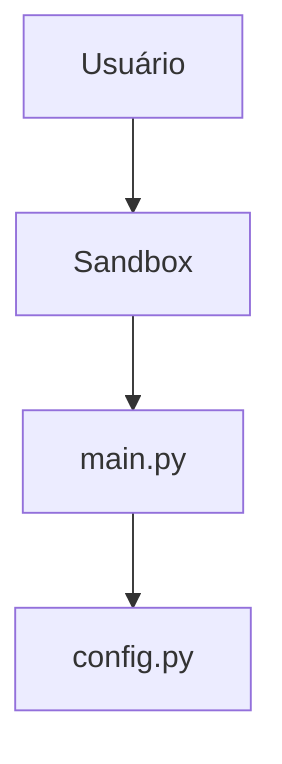

# Decisões de arquitetura — MVP Chatbot

Template de **ADR** (Architecture Decision Records). Preencha **em sala** (com IA) antes de pedir a criação do pacote `server/`.

> Referência: `arquitetura_mvp.md` (estrutura alvo). Após fechar as ADRs, use os prompts em `prompts.md` §2–§3 para gerar código.

---

## ADR-001 — Framework conversacional

| Campo | Conteúdo |
|-------|----------|
| **Status** | (preencha — proposta / aceita / rejeitada) |
| **Contexto** | Precisamos de comportamento previsível, não só um prompt único. |
| **Decisão** | _(qual framework? por quê Parlant?)_ |
| **Alternativas** | _(ex.: LangChain direto, prompt monolítico)_ |
| **Consequências** | _(trade-offs)_ |

---

## ADR-002 — Provider e modelo LLM

| Campo | Conteúdo |
|-------|----------|
| **Status** | (preencha) |
| **Contexto** | Endpoint unificado; modelo agentic para o MVP. |
| **Decisão** | _(OpenRouter + `openrouter/owl-alpha`? outro?)_ |
| **Alternativas** | |
| **Consequências** | |

---

## ADR-003 — Layout de módulos (`server/`)

| Campo | Conteúdo |
|-------|----------|
| **Status** | (preencha) |
| **Contexto** | Separar bootstrap, agente, guidelines e tools. |
| **Decisão** | _(árvore de pastas — copie de arquitetura_mvp.md e ajuste)_ |
| **Alternativas** | |
| **Consequências** | |

```
server/
├── __init__.py
├── config.py
├── main.py
├── agent.py
├── guidelines.py
└── tools/
    └── __init__.py
```

---

## ADR-004 — Configuração e segredos

| Campo | Conteúdo |
|-------|----------|
| **Status** | (preencha) |
| **Contexto** | API key não pode ir para o repositório. |
| **Decisão** | _(`.env`, `obter_config()`, biblioteca)_ |
| **Alternativas** | |
| **Consequências** | |

---

## ADR-005 — Interface de desenvolvimento

| Campo | Conteúdo |
|-------|----------|
| **Status** | (preencha) |
| **Contexto** | MVP sem front custom na primeira fase. |
| **Decisão** | _(sandbox Parlant? outro?)_ |
| **Alternativas** | |
| **Consequências** | |

---

## ADR-006 — Tools e RAG

| Campo | Conteúdo |
|-------|----------|
| **Status** | (preencha) |
| **Contexto** | Escopo limitado no MVP. |
| **Decisão** | _(fase 1 só guidelines? tool FAQ estática depois?)_ |
| **Alternativas** | |
| **Consequências** | |

---

## ADR-007 — Entrypoint assíncrono

| Campo | Conteúdo |
|-------|----------|
| **Status** | (preencha) |
| **Contexto** | SDK Parlant usa `async with p.Server()`. |
| **Decisão** | _(asyncio.run em main.py? composição de módulos?)_ |
| **Alternativas** | |
| **Consequências** | |

---

## Decisões adiadas

| ID | Tema | Por que adiar |
|----|------|----------------|
| D-01 | | |
| D-02 | | |

---

## Diagrama de camadas (rascunho)

_(desenhe em mermaid ou texto após fechar ADR-003)_


