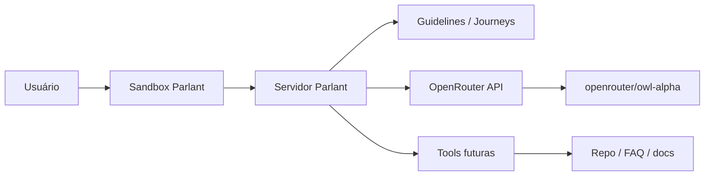

# Visão geral — MVP Chatbot (Parlant + OpenRouter)

Documento norteador do **projeto final** da formação. As próximas entregas evoluem este MVP até um assistente containerizado, testado e integrado ao pipeline de qualidade.

## 1. Problema

Times que usam IA no dia a dia precisam de um **assistente previsível** — não um chat genérico que inventa respostas. O MVP simula um **assistente de onboarding** da Formação Dev Elite: orienta sobre módulos, exercícios e fluxo de estudo, com comportamento controlado e rastreável.

## 2. Solução proposta

| Camada | Tecnologia | Papel |
|--------|------------|--------|
| **Comportamento conversacional** | [Parlant](https://www.parlant.io) | Guidelines, jornadas, ferramentas — controle do agente sem “prompt spaghetti” |
| **Inferência (LLM)** | [OpenRouter](https://openrouter.ai) | Provider unificado; modelo **`openrouter/owl-alpha`** (open source, tool use, contexto longo) |
| **Runtime** | Python 3.11+ | SDK Parlant (`parlant`) |
| **Interface (dev)** | Sandbox Parlant | UI local para testar o agente (`http://localhost:8800`) |

## 3. O que é Parlant (resumo)

Parlant é um framework de **engenharia de contexto** para agentes voltados a clientes/usuários:

- **Guidelines** — regras condicionais (quando X, faça Y).
- **Journeys** — fluxos passo a passo da conversa.
- **Tools** — integração com APIs, arquivos ou lógica de negócio.
- **Glossary** — termos do domínio (ex.: “módulo”, “exercício integrador”).
- **Explainability** — entender por que uma guideline disparou.

No MVP, priorizamos **guidelines + agente mínimo**; journeys e tools entram conforme o escopo avança.

## 4. OpenRouter + `openrouter/owl-alpha`

- **Model ID:** `openrouter/owl-alpha`
- **Chave:** `OPENROUTER_API_KEY` (nunca commitar — use `.env`)
- **Integração Parlant:** `p.NLPServices.openrouter(model_name="openrouter/owl-alpha", ...)`

Owl Alpha é indicado para workloads **agentic** (tool use, instruções longas). Para desenvolvimento local, validar quota e política de log do provider antes de usar em sala cheia.

## 5. Persona do agente (MVP)

| Campo | Valor |
|-------|--------|
| Nome | `assistente-formacao` |
| Descrição | Assistente de onboarding da Formação Dev Elite |
| Tom | Claro, objetivo, em português |
| Limites | Não inventar módulos ou URLs; admitir incerteza; não expor segredos |

## 6. Fluxo de alto nível



## 7. Entregáveis do arco do projeto (preview)

| Entrega | Tema principal |
|---------|----------------|
| Visão geral (esta aula) | Escopo, arquitetura, mapa das trilhas |
| Implementação do agente | Fundamentos + resolução de problemas |
| Qualidade e padrão | Testes, lint, format, `padrao_projeto_mvp.md` |
| Container + CI | Docker, pipeline, entrega profissional |

Detalhes de escopo: `escopo_mvp.md`.  
Detalhes de arquitetura: `arquitetura_mvp.md`.  
Cruzamento com trilhas do curso: `mapa_disciplinas.md`.

## 8. Pré-requisitos

- Python **3.11+**
- Conta OpenRouter com API key
- Git + editor com agente IA (Copilot / Cursor)
- Conhecimento consolidado das trilhas listadas em `mapa_disciplinas.md`

## 9. Variáveis de ambiente

Copie `.env.example` → `.env` e preencha:

```bash
OPENROUTER_API_KEY=sk-or-v1-...
PARLANT_MODEL=openrouter/owl-alpha
```

## 10. Próximo passo (execução assistida por IA)

1. Integrar `p.Server` + OpenRouter em `server/main.py` (`prompts.md` §1).
2. Implementar guidelines (`prompts.md` §2).
3. Testar ao vivo no sandbox — 5 cenários do `prompts.md` §3.
4. Testes pytest + pipeline + container — entrega seguinte.
